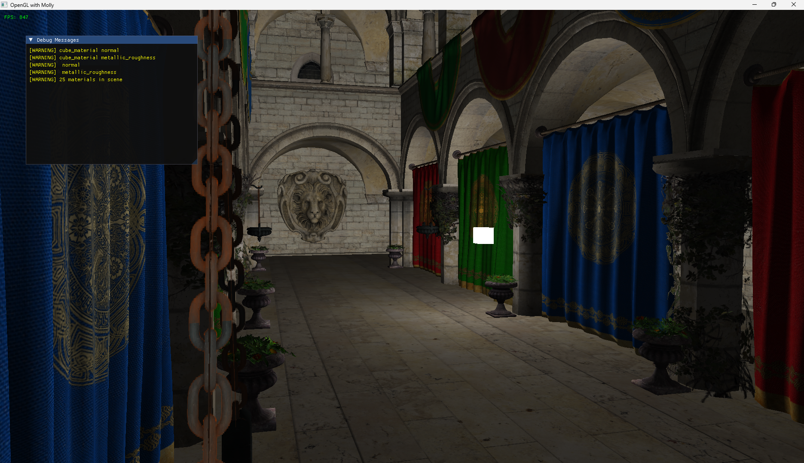

# Welcome to Molly
Molly is a learning project aimed to speed up my investingation into different computer graphics techniques.
For now the renderer remains a very early a work in progress and supports the bare minimum for 3D visualisation.

I have stoped working on this project to solidify my mathematical fundations. Once I feel I have done adequate work on that front, I will
be returning to computer grahpics (not necessarily on molly).

As far as the latest version of molly goes, these are the "features" currently available.
* glTF asset loading
* basic Phong lighting
* off-screen buffer rendering



### Build instructions
**1. Clone the repository:**
```
git clone --recursive https://github.com/Veil43/molly.git
```
*NOTE: if your forgot the `--recursive` flag, you can pull the dependencies with:*
`git submodule update --init --recursive`

**2. Generate build files:**
```
cmake -B <build-directory> -S . -G <generator> -DCMAKE_BUILD_TYPE=<build-mode/Release or Debug>
```

**3. Build the source code:**
```
cmake --build <build-directory> --config <build-mode/Release or Debug>
```

**4. Run molly:**
```
./<build-directory>/molly.exe
```